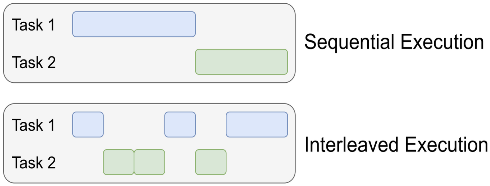

# Lecture notes: Week 7 - React: Asynchronous Programming
The lecture has been recorded. These are the teacher’s personal notes. They might not be perfect. This document is not meant as a complete transcript or replacement for the lecture, but contains the notes and tips for you to study after viewing the lecture.

## 1. Understanding Asynchronous JavaScript

In this lecture we explore how **JavaScript handles asynchronous operations** within a **single-threaded environment**, and how **React developers can leverage async/await, Promises, fetch (or Axios), and custom hooks** to manage asynchronous workflows in a clean manner.

### 1.1 What Does “Asynchronous” Mean?

**Asynchronous** means operations that occur at different times. When JavaScript makes an async call, a promise object is returned immediately to not block the remaining code so that the event flow can continue the execution of the rest of the program. JavaScript executes code sequentially (one line at a time) on a single thread, but it can handle asynchronous operations concurrently through its event loop and task queues.
Concurrency in JavaScript doesn’t come from multiple threads running JS code. Instead, it comes from the browser (or Node.js) handling tasks outside the main thread.

Example:
```js
console.log("Start");
setTimeout(() => console.log("Timeout done 2"), 2000);
setTimeout(() => console.log("Timeout done"), 1000);
console.log("End");
```
output:
```
Start
End
Timeout done
Timeout done 2
```

Explanation of code above:
- JS runs line by line: logs Start, schedules the setTimeout callback, logs End.
- The timer runs asynchronously in the browser’s Web API, not blocking JS.
- Once the timer finishes, the callback is placed in the callback queue.
- The event loop checks if the call stack is empty — only then that timeout callback function is pushed to the call stack for execution.

This is concurrency via coordination, not true multithreading.

There are two kinds of async queues:
- Microtask queue — handles Promises, queueMicrotask(), etc.
- Macrotask (callback) queue — handles setTimeout, setInterval, I/O, etc.

Microtasks always run before macrotasks when the current call (execution) stack clears.

### 1.2 Sequential vs Concurrent Execution in JS

- **Sequential:** Tasks execute one after another.
- **Concurrent:** Multiple tasks are *in progress* and the current thread/worker switches through the tasks (not *simultaneously executed*, so not parallellism).

Although JavaScript runs on a **single thread**, it does use concurrency via **event loops** and **callback queues**.

The image shows the difference between sequential and concurrent (in JavaScript):



If you want to read a little more about this: [This is a nice blogpost](https://www.rugu.dev/en/blog/concurrency-and-parallelism/).

## 2. JavaScript Execution Model

### Single-Threaded Nature

JavaScript executes code in a **single-threaded** environment—only one instruction runs at a time.

### So how does it handle async operations?
- The JS engine uses the **event loop** to execute what there is in the call-stack.
- Long-running tasks (e.g., HTTP requests) are delegated to **Web APIs** or **Node APIs**.
- Results are queued as **callback functions** to be executed later.

### Key Components of the JavaScript runtime
- **Call Stack**: Where functions are executed.
- **Event Loop**: Monitors the stack and callback queue.
- **Callback/Task Queue**: Stores functions to execute when the stack is empty.
- **Microtask Queue**: Holds Promises and async callbacks—**executed before** regular callbacks.

Because this is quite hard to visualize, it can be helpful to watch an animation or demonstration about this process.

This is a great video and blogpost that explains and visualizes the process:

> Study this:
[JavaScript Visualized - Event Loop, Web APIs, (Micro)task Queue](https://www.lydiahallie.com/blog/event-loop)
(by Lydia Hallie)

The References section at the end of this document includes another example.

## 3. Callback Functions

A **callback** is a function passed as an argument to another function, to be executed later.

```js
function fetchData(callbackExample) {
  setTimeout(() => {
    callbackExample("Data loaded!");
  }, 1000);
}

fetchData((data) => console.log(data));
```

## 4. Promises

A Promise represents a value that may be available now, later, or perhaps never.

Key Points:
- Promises are microtasks.
- Returned from async calls.
- Help avoid deeply nested callback structures.

```js
const myPromise = new Promise((resolveFunc, rejectFunc) => {
  setTimeout(() => {
    resolveFunc("foo");
  }, 300);
});

myPromise
  .then(handleFulfilledA)
  .then(handleFulfilledB)
  .then(handleFulfilledC)
  .catch(handleRejectedAny);
```

## 5. Fetch API
The fetch() method provides a modern interface for making HTTP requests.
```js
fetch("https://api.example.com/data")
  .then((response) => response.json())
  .then((data) => console.log(data))
  .catch((error) => console.error(error));
```
What happens internally:
1. The request is initiated and handed off to a Web API.
2. The main thread continues execution.
3. When data returns, a microtask is queued to be processed in the `.then()` handler.

## 6. Async / await
This is "syntactic sugar" over Promises — it makes asynchronous code look synchronous.
```js
async function getData(url: string) {
    try {
        const response = await fetch(url);
        const data = await response.json();
        return data;
    } catch (error) {
        console.log("Error message: ", error);
    }
}
```
The `await` keywoard pauses that line of code until the function that is **awaited** returns. So the line `const response = await fetch(url);` will not continue its execution until the fetch() request returns with a response or error.

## 7. Axios - Alternative for fetch
Instead of `fetch()`, some developers use Axios, a promise-based HTTP client.
```js
import axios from "axios";

async function getUsers() {
  const response = await axios.get("https://api.example.com/users");
  return response.data;
}
```
Some benefits of using axios are:
- Automatic JSON parsing
- Request cancellation via the [AbortController](https://developer.mozilla.org/en-US/docs/Web/API/AbortController$0) with [examples](https://axios-http.com/docs/cancellation$0)
- Interceptors for requests/responses with [examples](https://axios-http.com/docs/interceptors$0)

## 8. Custom Hooks in React
Custom hooks allow developers to encapsulate logic and reuse stateful behavior across components.

Rules of Hooks:
- Must start with use (e.g., useFetch, useApi).
- Only call hooks inside:
- React function components
- Other custom hooks

This is an example of a custom hook we called **useFetch** that implements fetch()

```js
import { useState, useEffect } from "react";

export function useFetch<T>(url) {
  const [data, setData] = useState<T[]>([]);
  const [loading, setLoading] = useState<boolean>(true);
  const [error, setError] = useState<string>("");

  useEffect(() => {
    async function fetchData() {
      try {
        const response = await fetch(url);
        const result = await response.json();
        setData(result);
      } catch (err) {
        setError(err);
      } finally {
        setLoading(false);
      }
    }
    fetchData();
  }, [url]);

  return { data, loading, error };
}
```

or with the `then()` syntax
```js
import { useState, useEffect } from "react";

export function useFetch<T>(url) {
  const [data, setData] = useState<T[]>([]);
  const [loading, setLoading] = useState<boolean>(false);
  const [error, setError] = useState<string>("");

  useEffect(() => {
    setIsLoading(true);
    fetch(url)
        .then(response => response.json())
        .then(responseData => setData(responseData))
        .catch(error => {
            if (error instanceOf Error) setError(error.message);
            else setError("There was some error!");
        })
        .finally(setIsLoading(false));
  }, [url]);

  return { data, loading, error };
}
```

## References
- [Promises](https://developer.mozilla.org/en-US/docs/Web/JavaScript/Reference/Global_Objects/Promise) (MDN)
- [Multi-tasking in single-threaded JS](https://stackoverflow.com/questions/36233028/how-does-multi-threading-or-async-code-in-javascript-work) (StackOverflow)
- [Difference between sequential, concurrent, and parallel](https://www.rugu.dev/en/blog/concurrency-and-parallelism/) (Blog by Uğur Erdem Seyfi)
- [JavaScript Visualized - Event Loop, Web APIs, (Micro)task Queue](https://www.lydiahallie.com/blog/event-loop)
(Blog and video by Lydia Hallie)
- [What the heck is the event loop anyway? ](https://www.youtube.com/watch?v=8aGhZQkoFbQ) (Philip Roberts, YouTube)
- [Execution context (call stack)](https://www.codemancers.com/blog/2022-10-26-how-asynchronous-js-works) (Blog by Vinay Sripath)
- [About creating a generic fetch hook](https://dev.to/jeeny/how-to-create-an-api-layer-with-react-hooks-and-typescriptand-why-3a8o) (Blog by Scott Schwartz)